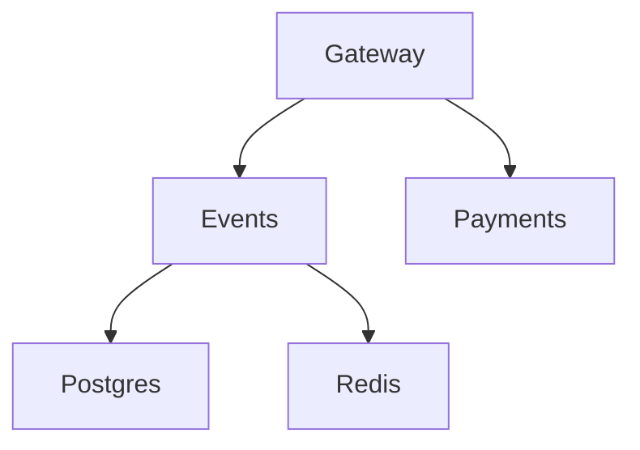

# Lab 1 — SRE Philosophy: Deploy, Break, Understand

## Docker Compose Status

All 5 services are running successfully:

```bash
NAME                IMAGE                    STATUS                      PORTS
app-events-1        app-events               Up                          0.0.0.0:8081->8081/tcp
app-gateway-1       app-gateway              Up                          0.0.0.0:3080->8080/tcp
app-payments-1      app-payments             Up                          0.0.0.0:8082->8082/tcp
app-postgres-1      postgres:17-alpine       Up (healthy)                0.0.0.0:5432->5432/tcp
app-redis-1         redis:7-alpine           Up (healthy)                0.0.0.0:6379->6379/tcp
```

## Critical Path (Everything Working)

### 1. List Events

```json
[
  {
    "id": 1,
    "name": "Go Conference 2026",
    "venue": "Main Hall A",
    "date": "2026-09-15T09:00:00+00:00",
    "total_tickets": 100,
    "price_cents": 5000,
    "available": 99
  },
  {
    "id": 4,
    "name": "Python Workshop",
    "venue": "Lab 301",
    "date": "2026-09-22T14:00:00+00:00",
    "total_tickets": 25,
    "price_cents": 2000,
    "available": 25
  },
  {
    "id": 2,
    "name": "SRE Meetup",
    "venue": "Room 204",
    "date": "2026-10-01T18:00:00+00:00",
    "total_tickets": 30,
    "price_cents": 0,
    "available": 30
  },
  {
    "id": 5,
    "name": "Kubernetes Deep Dive",
    "venue": "Auditorium B",
    "date": "2026-10-10T10:00:00+00:00",
    "total_tickets": 80,
    "price_cents": 8000,
    "available": 80
  },
  {
    "id": 3,
    "name": "Cloud Native Summit",
    "venue": "Expo Center",
    "date": "2026-11-20T10:00:00+00:00",
    "total_tickets": 500,
    "price_cents": 15000,
    "available": 500
  }
]
```

### 2. Reserve a Ticket

```json
{
  "reservation_id": "a3370485-51ea-46bf-a3b1-c6cf7a101df4",
  "event_id": 1,
  "quantity": 1,
  "total_cents": 5000,
  "expires_in_seconds": 300
}
```

### 3. Pay for Reservation

```json
{
  "order_id": "a3370485-51ea-46bf-a3b1-c6cf7a101df4",
  "event_id": 1,
  "quantity": 1,
  "total_cents": 5000,
  "status": "confirmed"
}
```

### 4. Health Check

```json
{
  "status": "healthy",
  "checks": {
    "events": "ok",
    "payments": "ok",
    "circuit_payments": "CLOSED"
  }
}
```

## Dependency Map



## Failure Table

| Component Killed | Events List | Reserve | Pay   | Health Check | User Impact                      |
| ---------------- | ----------- | ------- | ----- | ------------ | -------------------------------- |
| payments         | Works       | Works   | Fails | degraded     | Can reserve but cannot pay       |
| events           | Fails       | Fails   | Fails | degraded     | Cannot browse or buy tickets     |
| redis            | Works       | Works   | Works | ok           | Minor impact                     |
| postgres         | Fails       | Fails   | Fails | degraded     | Events service completely broken |

## Load Generator Test

I ran the load generator:

```bash
../loadgen/run.sh 5 30
```

While it was running, I stopped the payments service. The error rate increased significantly, but list and reserve endpoints continued working. This demonstrates the blast radius of the payments service and validates graceful degradation behavior.

## Task 2 — Graceful Degradation

Modified `gateway/main.py` to return a clear 503 response when payments are unavailable.

Example response:

```json
{
  "error": "payments_unavailable",
  "message": "Payment service is temporarily down. Your reservation is held — try again in a few minutes.",
  "reservation_id": "..."
}
```

Results:

* Reserve endpoint continued working.
* Pay endpoint returned a friendly error message.
* User experience degraded gracefully instead of failing unexpectedly.

## Bonus Task — Resource Usage

### Idle

```bash
NAME            CPU %    MEM USAGE
app-gateway-1   0.25%    38.11MiB
app-events-1    0.25%    41MiB
app-payments-1  0.23%    32.96MiB
app-postgres-1  2.59%    23.89MiB
app-redis-1     0.86%    3.66MiB
```

### Observations

* PostgreSQL consumed the highest CPU while idle.
* Redis used the least memory.
* Gateway and Events services increased CPU usage under load because they handled incoming traffic.
* When Payments was unavailable Gateway retained requests longer and showed increased resource utilization.

## GitHub Community
I starred the course repository and the `simple-container-com/api` project.
I followed the professor (@Cre-eD), TAs (@Naghme98, @pierrepicaud), and several classmates.
Starring repositories supports maintainers and helps useful projects gain visibility. Following developers helps me learn from their work and expand my professional network.
